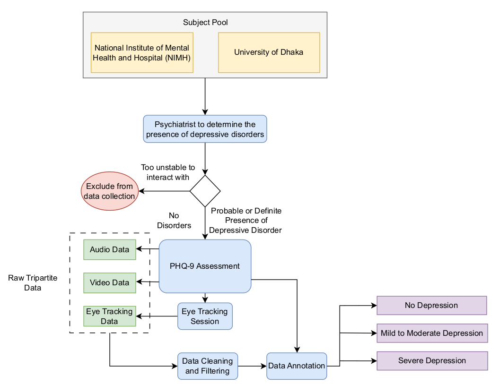
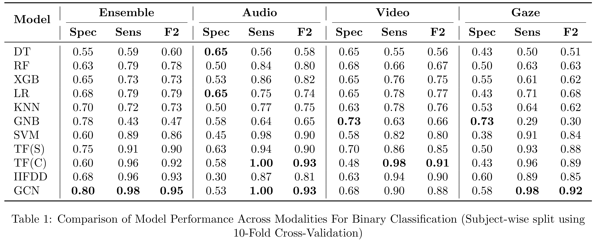
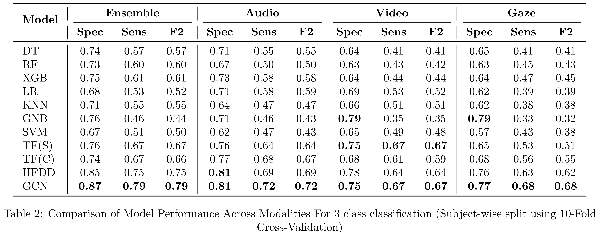

# Seeing, Observing, and Hearing Depression: An AI-driven Tri-Modal Diagnostic Approach

## Project Overview

Clinical depression diganosis heavily relies on self reported assessments that are subjected to bias. Our project works to eliminate this subjective bias by developing and validation a novel multimodal AI framwork that will be a more objective diagnositc tool. We use three distinct modalities to track the behavioural cues that depression persons show to give a more accurate approach to identifyting depression severity.

Our key contributions are:

1.  **A New Tri-Modal Dataset:** A gold-standard dataset of 103 participants. This dataset includes audio, facial video, and saliency data with ground-truth PHQ-9 scores.

2.  **High Frequency Signals:** Exisitng graph based depression detection methods primarily focus on low frequency signals. We demonstrate the high frequency signals contain critical information for depression detection

3.  **Advanced Graph filtering:** The Multi-Frequency Filter-Bank Module (MFFBM), which allows our GCN to capture both shared patterns (low-frequency) and subtle, unique diagnostic clues (high-frequency) that other models miss.

4.  **Saliency map fusion:** Use of saliency map in a multimodal approach has not been explored before us.

## Data Collection

## 🧠 Model Architecture

Our framework first extracts features from each modality in three separate streams. These features are then passed through our Graph Convolution Network(GCN) and the Multi-Frequency Filter Bank Module(MFFBM) that uses both high and low pass signals to do the final classification

## ✨ Key Results

The evaluation was done in two tasks - 
1. 3 Class severity classification -
   a. No Depression,
   b. Mild to Moderate Depression &
   c. Severe Depression
3. Binary (Depressed/Not-Depressed) classification

* **📈 3-Class Severity Task:** Our model demonstrated strong performance in metrics crucial for clinical relevance.
    * **Sensitivity:** 79%
    * **Specificity:** 87%
    * **F2-Score:** 79%

* **📊 Binary Task (Depressed/Not-Depressed):** Our model showed execellent performance in identyfing depressed patients highlighted by the high Sensitivity score
    * **Sensitivity:** 98%
    * **Specificity:** 80%
    * **F2-Score:** 95%
      
   These high Recall and F2 scores highlight the model's effectiveness in correctly identifying patients with depression.

* **🏆 Outperformed >10 Baselines**, including traditional machine learning algorithms and other deep learning models.

Note: Bold values indicate the best performance for each metric within each modality.

Abbreviations: DT = Decision Tree [8](#reference-8), RF = Random Forest [1](#reference-1), XGB = XGBoost [3](#reference-3), LR = Logistic Regression [6](#reference-6), KNN = K-Nearest Neighbors [5](#reference-5), GNB = Gaussian Naive Bayes [7](#reference-7), SVM = Support Vector Machine [4](#reference-4), TF(S) = Self Attention Transformer [9](#reference-9), TF(C) = Cross Attention Transformer [9](#reference-9), IIFDD = Intra and inter-modal fusion for depression detection [2](#reference-2), GCN = Graph Convolutional Network (Ours)

Metrics: Spec = Specificity, Sens = Sensitivity, F2 = F2-Score.

## References

1.  Breiman, L. (2001). Random forests. *Machine Learning*, *45*(1), 5–32. [https://doi.org/10.1023/A:1010933404324](https://doi.org/10.1023/A:1010933404324)

2.  Chen, J., Hu, Y., Lai, Q., Wang, W., Chen, J., Liu, H., Srivastava, G., Bashir, A. K., & Hu, X. (2024). IIFDD: Intra and inter-modal fusion for depression detection with multi-modal information from Internet of Medical Things. *Information Fusion*, *102*, 102017. [https://doi.org/10.1016/j.inffus.2023.102017](https://doi.org/10.1016/j.inffus.2023.102017)

3.  Chen, T., & Guestrin, C. (2016). XGBoost: A scalable tree boosting system. In *Proceedings of the 22nd ACM SIGKDD International Conference on Knowledge Discovery and Data Mining* (pp. 785–794). [https://doi.org/10.1145/2939672.2939785](https://doi.org/10.1145/2939672.2939785)

4.  Cortes, C., & Vapnik, V. (1995). Support-vector networks. *Machine Learning*, *20*(3), 273–297. [https://doi.org/10.1007/BF00994018](https://doi.org/10.1007/BF00994018)

5.  Cover, T., & Hart, P. (1967). Nearest neighbor pattern classification. *IEEE Transactions on Information Theory*, *13*(1), 21–27. [https://doi.org/10.1109/TIT.1967.1053964](https://doi.org/10.1109/TIT.1967.1053964)

6.  Cox, D. R. (1958). The regression analysis of binary sequences. *Journal of the Royal Statistical Society: Series B (Methodological)*, *20*(2), 215–242. [https://doi.org/10.1111/j.2517-6161.1958.tb00292.x](https://doi.org/10.1111/j.2517-6161.1958.tb00292.x)

7.  Duda, R. O., Hart, P. E., & Stork, D. G. (2000). *Pattern classification* (2nd ed.). John Wiley & Sons.

8.  Quinlan, J. R. (1986). Induction of Decision Trees. *Machine Learning*, *1*(1), 81–106. [https://doi.org/10.1023/A:1022643204877](https://doi.org/10.1023/A:1022643204877)

9.  Rajan, V., Brutti, A., & Cavallaro, A. (2022). Is cross-attention preferable to self-attention for multi-modal emotion recognition? In *ICASSP 2022 - 2022 IEEE International Conference on Acoustics, Speech and Signal Processing (ICASSP)* (pp. 4693–4697). IEEE. [https://doi.org/10.1109/ICASSP43922.2022.9746924](https://doi.org/10.1109/ICASSP43922.2022.9746924)
